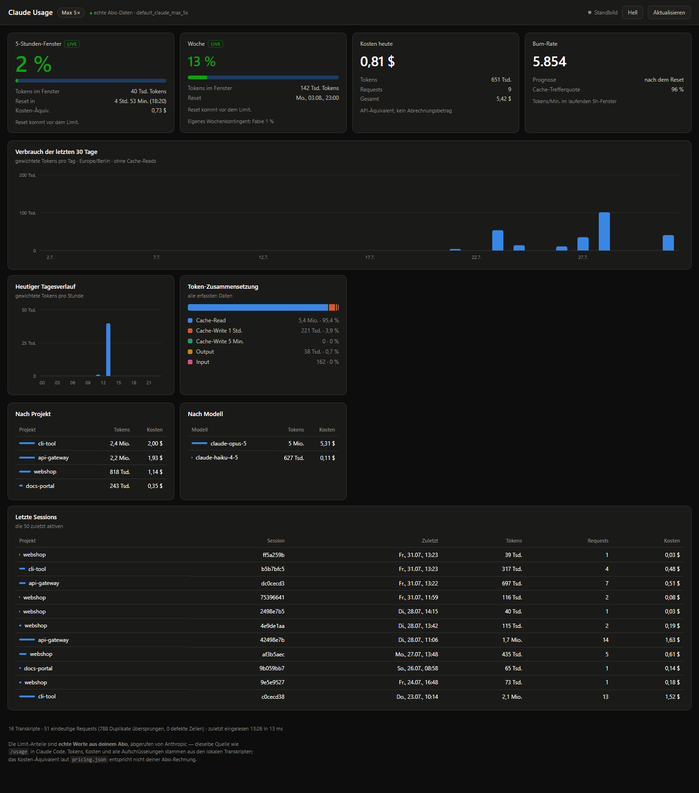
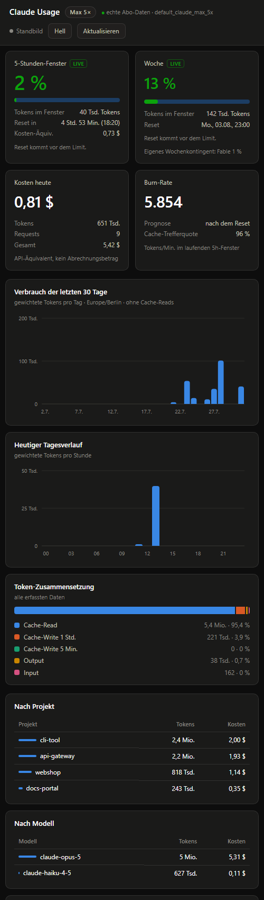

# Claude Usage Dashboard

Lokales Dashboard für den Verbrauch deines Claude-Code-Abos. Zeigt laufend an, wo du im
5-Stunden- und im Wochenfenster stehst — und was das je Projekt, Modell und Session gekostet
hat.

**Kein API-Key nötig, keine Telemetrie, kein fremder Server.** Der Webserver bindet
ausschließlich an `127.0.0.1`. Null Laufzeit-Abhängigkeiten.

## Zwei Datenquellen, die sich ergänzen

|  | Anthropic-API | Lokale Transkripte |
|---|:---:|:---:|
| Auslastung 5h / Woche | **echt** | nur schätzbar |
| Reset-Zeitpunkt | **exakt** | nur modelliert |
| Modellspezifische Kontingente | **ja** | – |
| Kosten-Äquivalent (USD) | – | **ja** |
| Pro Projekt / Modell / Session | – | **ja** |
| 30-Tage-Historie, Burn-Rate | – | **ja** |
| Funktioniert offline | – | **ja** |

Die Limit-Anzeigen kommen von Anthropic (`GET /api/oauth/usage`, authentifiziert mit dem
OAuth-Token, das Claude Code unter `~/.claude/.credentials.json` ablegt) — dieselbe Quelle,
aus der auch `/usage` in Claude Code speist. Alles andere kommt aus den JSONL-Transkripten,
die Claude Code ohnehin schreibt. **Das Token wird nur gelesen, nie geschrieben, und geht
ausschließlich an `api.anthropic.com`.**

Ist die API nicht erreichbar (offline, Token abgelaufen, `liveUsage.enabled: false`), fällt
das Dashboard sichtbar gekennzeichnet auf die lokale Hochrechnung zurück, statt zu scheitern.

> **Hinweis:** `/api/oauth/usage` gehört nicht zur öffentlich dokumentierten API und kann sich
> ohne Ankündigung ändern. Das Parsen ist defensiv; bei unbekanntem Format schaltet das
> Dashboard auf die Schätzung um und sagt das auch.

## Schnellstart

```bash
npm start        # danach http://localhost:7842 öffnen
npm run open     # dasselbe, öffnet den Browser gleich mit
npm test         # 119 Unit-Tests
```

Kein Build-Schritt, kein `npm install` — das Projekt hat keine Dependencies. Voraussetzung ist
nur Node ≥ 20.

### Ohne Terminal starten

**macOS:** `Dashboard starten.command` liegt im Projektordner — einmalig `chmod +x`, dann per
Doppelklick im Finder startbar.

**Windows:** Verknüpfung einmalig selbst anlegen (sie ist bewusst nicht eingecheckt —
`.lnk`-Dateien betten Rechnernamen und Volume-GUIDs ein). Diesen Einzeiler im Projektordner in
PowerShell ausführen — kein Skript, also auch kein Ärger mit der Ausführungsrichtlinie:

```powershell
$p=$PWD.Path; $w=New-Object -ComObject WScript.Shell; $s=$w.CreateShortcut("$p\Dashboard starten.lnk")
$s.TargetPath=(Get-Command node).Source; $s.Arguments="`"$p\src\server.js`" --open"
$s.WorkingDirectory=$p; $s.WindowStyle=7; $s.Save()
```

Beide starten den Server und öffnen den Browser; das Fenster schließen beendet ihn wieder. Die
Verknüpfung lässt sich auf den Desktop kopieren oder an die Taskleiste anheften.

**Sie verändern nichts am System** — kein Autostart, kein Registry-Eintrag, keine
Aufgabenplanung, keine Dienstregistrierung. Es sind nur Dateien. Die Windows-Verknüpfung zeigt
direkt auf `node.exe` und umgeht damit jeden Skript-Interpreter, was auf Geräten mit
AppLocker/WDAC relevant ist.

### Autostart auf verwalteten Geräten (Intune/SCCM)

Technisch ginge Autostart auch ohne Admin-Rechte und ohne Freigabe: der Ordner
`shell:startup` ist für Benutzer beschreibbar, und WDAC greift bei Node-Skripten nicht (es
kontrolliert PowerShell, WSH und MSI — nicht Nodes eigenen Interpreter).

**Empfohlen wird das hier trotzdem nicht.** Ein Autostart-Eintrag ist ein
Persistenz-Mechanismus; ein Prozess, der bei jeder Anmeldung startet, ein OAuth-Token liest und
regelmäßig nach außen telefoniert, ist auf einem gehärteten Firmengerät genau das Muster, das
EDR-Systeme melden. Wenn du es dennoch willst, kläre es vorher mit deiner IT — und lege dann
einfach die obige Verknüpfung nach `shell:startup` (Windows) bzw. richte einen LaunchAgent
unter `~/Library/LaunchAgents/` ein (macOS). Beides braucht keine Admin-Rechte.

## Ansichten

### Dashboard



Oben vier Statuskacheln (5h-Fenster, Woche, Kosten heute, Burn-Rate), darunter der
30-Tage-Verlauf, der heutige Tagesverlauf, die Token-Zusammensetzung sowie Aufschlüsselungen
nach Projekt, Modell und Session.

### Schmales Fenster



Ab ca. 470 px klappt das Raster auf eine Spalte um; die Charts rechnen sich auf die
tatsächliche Containerbreite neu (`ResizeObserver`). Funktioniert neben dem Editor.

## Was die Zahlen bedeuten

**1. Die Prozentwerte sind echt — die Tokenzahlen daneben nicht dasselbe.** Die 37 % im
5h-Fenster kommen von Anthropic. Wie Anthropic intern gewichtet, ist nicht öffentlich; die
Tokenzahl in derselben Kachel ist deshalb **nicht** „37 % von irgendwas", sondern schlicht die
Summe aus deinen Transkripten für exakt dasselbe Zeitfenster (Reset-Zeit minus Fensterlänge).
Beide Angaben sind korrekt, messen aber Verschiedenes.

**Nur** wenn die API ausfällt, greift die lokale Schätzung: standardmäßig **selbstkalibrierend**
(`limits.mode: "auto"`, 100 % = dein bisher höchstes gemessenes Fenster), und solange dafür zu
wenig Historie da ist, zeigt die Kachel „Kalibrierung läuft" statt einer erfundenen Zahl. Feste
Planwerte gibt es auch, sie sind aber nur geraten:

```jsonc
"limits": { "mode": "fixed", "plans": { "max5x": { "fiveHourTokens": 88000 } } }
```

**2. Cache-Reads zählen standardmäßig nicht gegen die lokale Schätzung.** In echten Transkripten sind
**über 99 % aller Tokens Cache-Reads** — erneutes Lesen bereits gezählten Kontextes, das nur
0,1× kostet. Würden sie voll mitzählen, wäre jede Limit-Anzeige sinnlos. Die Gewichtung ist
einstellbar:

```jsonc
"counting": { "weights": { "input": 1, "output": 1, "cacheWrite": 1, "cacheRead": 0 } }
```

Die Kosten enthalten Cache-Reads selbstverständlich vollständig — nur die *Limit*-Zählung
klammert sie aus.

**3. Die Kosten sind das API-Preis-Äquivalent, nicht deine Rechnung.** Mit einem Pro/Max-Abo
zahlst du eine Pauschale. Der USD-Betrag beantwortet die Frage „was hätte das über die API
gekostet" — nützlich als Größenordnung und für den Vergleich zwischen Projekten.

## Konfiguration

### `config.json`

| Feld | Bedeutung |
|---|---|
| `port` | Port des lokalen Servers (Standard 7842) |
| `liveUsage.enabled` | Echte Werte von Anthropic abrufen. `false` = reiner Offline-Betrieb |
| `liveUsage.minIntervalMs` | Drosselung des API-Abrufs (Standard 60 s, unabhängig vom 20-s-Polling) |
| `timezone` / `locale` | `Europe/Berlin` / `de-DE` für alle Anzeigen |
| `plan` | Nur **Rückfallwert**. Der Tarif wird aus `rateLimitTier` in den Zugangsdaten gelesen (auch offline) und überstimmt diesen Eintrag. Wird er verwendet, markiert das Dashboard das Badge mit „?" |
| `limits.mode` | `auto` (selbstkalibrierend) oder `fixed` (Werte aus `plans`) |
| `limits.autoMinSamples` | Ab wie vielen abgeschlossenen Fenstern `auto` greift |
| `counting.weights` | Welche Token-Arten gegen das Limit zählen |
| `window.fiveHourBlockHours` | Fensterlänge (Standard 5) |
| `week.resetWeekday/-Hour/-Minute` | **Hier deinen echten Wochen-Reset eintragen.** `0` = Sonntag, `1` = Montag … |
| `warnings.warnPercent` / `criticalPercent` | Schwellen für gelb / rot (Standard 70 / 90) |
| `server.pollIntervalMs` | Fallback-Rescan, falls der File-Watcher nicht feuert |
| `dataDirs.extra` | Zusätzliche Transkript-Pfade (ergänzend zur Autodiscovery) |
| `dataDirs.only` | Autodiscovery abschalten und ausschließlich diese Pfade lesen |

### `pricing.json`

Preise in USD pro 1 Mio. Tokens, zum Selbstpflegen. Regeln:

- `cacheWrite5m` = 1,25× Input · `cacheWrite1h` = **2,0×** Input · `cacheRead` = 0,1× Input
- `fast` — optionaler Block, greift bei `usage.speed == "fast"`
- `promo` — befristeter Einführungspreis mit `until`; historische Einträge bleiben dadurch
  korrekt bepreist, auch nachdem die Aktion abgelaufen ist
- Unbekannte Modelle stürzen nicht ab, sondern erscheinen als **„Preis unbekannt"** und werden
  in der Fußzeile aufgeführt. Ihre Tokens zählen weiterhin mit.

## Wie es funktioniert

**Echte Auslastung.** `GET https://api.anthropic.com/api/oauth/usage` mit dem OAuth-Token aus
`~/.claude/.credentials.json` (Header `Authorization: Bearer …` plus
`anthropic-beta: oauth-2025-04-20`). Die Antwort liefert `five_hour`/`seven_day` mit
`utilization` und `resets_at` sowie ein `limits[]`-Array mit `severity` und modellspezifischen
Wochenkontingenten. Aus `resets_at` minus Fensterlänge ergibt sich der Fensterstart — damit
lassen sich die lokalen Transkripte auf **exakt dasselbe Fenster** summieren.

Das Token wird bei jedem Abruf frisch von der Platte gelesen: Claude Code rotiert es selbst,
und wir erneuern nichts, um dessen Sitzung nicht zu stören. Läuft es ab, sagt das Dashboard
das und rechnet lokal weiter. Der Abruf ist auf 60 s gedrosselt, damit das 20-Sekunden-Polling
nicht zu 20-Sekunden-API-Aufrufen führt.

**Aufschlüsselungen** kommen aus den JSONL-Transkripten unter
`~/.claude/projects/<projekt>/<session>.jsonl` (zusätzlich werden `$CLAUDE_CONFIG_DIR` und
`~/.config/claude` geprüft).

**Deduplizierung — der wichtigste Teil.** Claude Code schreibt **eine Zeile pro Content-Block**
(text, tool_use, thinking) und hängt an *jede* das vollständige, identische `usage`-Objekt.
Beim Test standen 3.288 Zeilen für nur 1.715 echte Requests. Ohne Deduplizierung über
`message.id` + `requestId` werden Output-Tokens um den Faktor **2,3** und Cache-Reads um
**1,7** überzählt. Fehlt ausnahmsweise die `requestId`, wird auf `uuid` zurückgefallen — sonst
kollabieren diese Einträge auf einen gemeinsamen Schlüssel und verschwinden.

**Cache-Writes nach TTL getrennt.** `cache_creation` schlüsselt in `ephemeral_5m` und
`ephemeral_1h` auf; die kosten 1,25× bzw. 2,0× Input. In echten Daten ist praktisch alles 1h.
Wer pauschal mit 1,25× rechnet, unterschätzt diesen Posten um 37 %.

**5-Stunden-Fenster als Session-Block.** Ein Block beginnt mit der ersten Nachricht nach einer
Pause, abgerundet auf die volle Stunde, und läuft dann fest 5 Stunden. Nach >5 h Pause oder
Ablauf des Fensters beginnt ein neuer Block. Das entspricht der Konvention von `ccusage`.

**Projekt-Identität ist der Transkript-Ordner, nicht `cwd`.** Während einer Sitzung wechselt
`cwd` in Unterverzeichnisse — gruppiert man danach, zerfällt ein Projekt in „src", „server",
„components". Der Anzeigename stammt aus dem *flachsten* beobachteten `cwd`.

**Inkrementelles Einlesen.** Pro Datei wird der Byte-Offset gemerkt; ein Rescan liest nur den
angehängten Teil (typisch wenige KB statt 26 MB). Eine unvollständige letzte Zeile — Claude
Code schreibt ja gerade weiter — wird nicht konsumiert, sondern beim nächsten Lauf komplett
verarbeitet. Schrumpft eine Datei, wird sie vollständig neu gelesen.

**Aktualisierung.** `fs.watch` (rekursiv) mit Entprellung, plus Polling alle 20 s als Fallback.
Änderungen gehen per Server-Sent Events an den Browser; kein Neuladen nötig.

**Robustheit.** Kaputte JSONL-Zeilen werden übersprungen und gezählt (in der Fußzeile
sichtbar). `<synthetic>`-Einträge sind API-Fehler-Platzhalter und werden ausgeschlossen.

## Tests

```bash
npm test
```

110 Tests über Parsing, Deduplizierung, Kostenberechnung, Fensterlogik und den Live-Abruf,
u. a.:

- Auslastung, Reset-Zeit und modellspezifische Kontingente werden korrekt ausgelesen;
  Fensterstart wird aus Reset minus Fensterlänge rekonstruiert
- abgelaufenes Token wird **nicht** selbst erneuert (würde Claude Codes Sitzung stören)
- 401/403, Netzwerkfehler, Timeout und geändertes Antwortformat degradieren auf die
  Schätzung, statt zu werfen

- drei Content-Blöcke desselben Requests ergeben **einen** Eintrag
- fehlende `requestId` kollabiert Einträge nicht
- unvollständige letzte Zeile wird nicht konsumiert; Mehrbyte-UTF-8 überlebt die Offset-Grenze
- 1h-Cache-Write kostet exakt das 1,6-fache eines 5m-Writes
- Einführungspreis gilt vor dem Stichtag und danach nicht mehr
- **Sommerzeit:** der 29.03.2026 hat 23 Stunden, der 25.10.2026 deren 25; das Wochenfenster
  über die Umstellung ist 167 bzw. 169 Stunden lang, der Reset bleibt auf Mitternacht Ortszeit
- Tagesgrenzen laufen nach `Europe/Berlin`, nicht nach UTC

## Auf ein anderes Gerät mitnehmen

Ordner kopieren, `npm start`. Voraussetzung ist Node ≥ 20 und ein dort eingeloggtes Claude
Code. Das Dashboard liest immer die **lokal** vorhandenen Zugangsdaten und Transkripte, zeigt
also den Account des jeweiligen Geräts.

An der `config.json` ist nichts umzustellen: der **Tarif** wird aus `rateLimitTier` in den
Zugangsdaten gelesen (Pro / Max 5× / Max 20×, funktioniert auch offline), die **Reset-Zeiten**
kommen aus dem Live-Abruf. Nur wenn gar keine Zugangsdaten gefunden werden, greift `plan` aus
der Config — dann steht ein „?" am Badge.

Ein Account lässt sich **nicht** von einem zweiten Gerät aus überwachen. Dafür müsste man
`~/.claude/.credentials.json` kopieren; dieses Token erlaubt Inferenz auf Kosten des Kontos und
rotiert ohnehin regelmäßig. Für mehrere Accounts das Dashboard je Gerät starten.

> ⚠️ Achte beim Weitergeben eigener Screenshots darauf, dass darin Projektnamen, Kosten und
> Session-IDs sichtbar sind. Die Bilder in `docs/` stammen aus **synthetischen Demo-Daten**;
> die Auslastungswerte in den Kacheln sind echt, alles andere ist erfunden.

## Nicht-Ziele

Kein Multi-User-Betrieb, keine Authentifizierung, kein Docker, kein Tracking von
API-Console-Kosten.

## Projektstruktur

```
config.json         Einstellungen (Limits, Zeitzone, Warnschwellen)
pricing.json        Preistabelle je Modell
src/
  liveUsage.js      Echte Auslastung von Anthropic (OAuth-Token, defensives Parsen)
  tz.js             Zeitzonen-/Sommerzeit-Rechnung
  parser.js         Discovery, JSONL-Parsing, Dedup-Schlüssel, inkrementelles Lesen
  pricing.js        Tarifauflösung und Kostenberechnung
  windows.js        5h-Session-Blöcke, Wochenfenster, Burn-Rate, Prognose
  aggregate.js      Aufschlüsselungen und Dashboard-Snapshot
  store.js          In-Memory-Index, Datei-Offsets, File-Watcher
  server.js         HTTP + SSE + statische Auslieferung
public/             Frontend (kein Build-Schritt)
test/               Unit-Tests (node:test)
```

Nützlich beim Debuggen: `GET /api/snapshot` liefert den kompletten Datensatz als JSON,
`?static=1` an der Dashboard-URL lädt einmalig ohne offenen SSE-Strom (für Screenshots).
