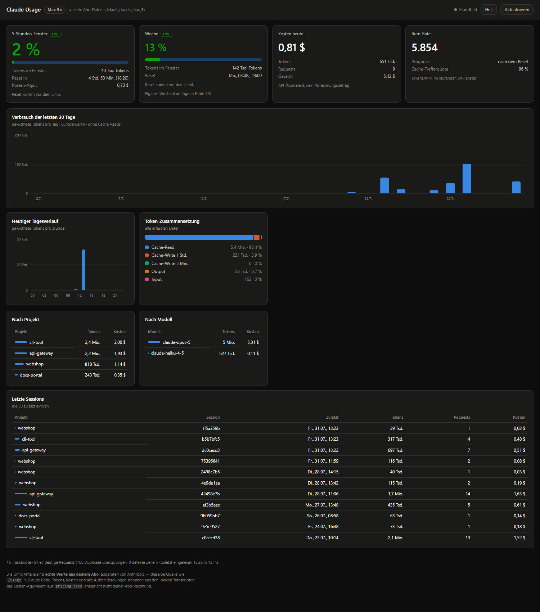
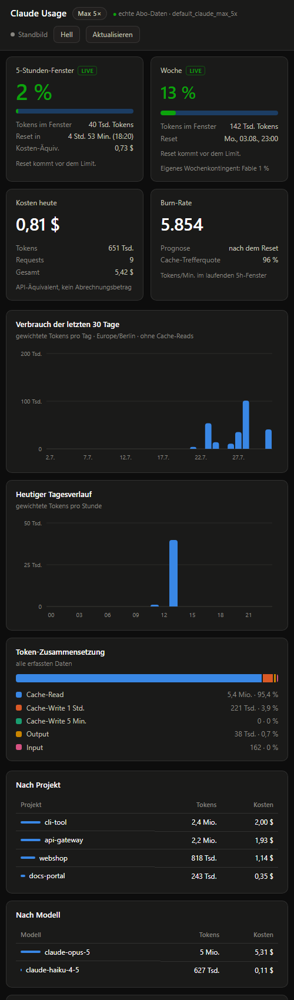

# Claude Usage Dashboard

Lokales Dashboard für den Verbrauch deines Claude-Code-Abos. Zeigt laufend an, wo du im
5-Stunden- und im Wochenfenster stehst — und was das je Projekt, Modell und Session gekostet
hat.

**Kein API-Key nötig, keine Telemetrie, kein fremder Server.** Der Webserver bindet
ausschließlich an `127.0.0.1`. Null Laufzeit-Abhängigkeiten.

## Zwei Datenquellen, die sich ergänzen

|  | Anthropic-API | Lokale Transkripte |
|---|:---:|:---:|
| Auslastung 5h / Woche | **echt** | nur schätzbar |
| Reset-Zeitpunkt | **exakt** | nur modelliert |
| Modellspezifische Kontingente | **ja** | – |
| Kosten-Äquivalent (USD) | – | **ja** |
| Pro Projekt / Modell / Session | – | **ja** |
| Zeitreihe, Burn-Rate | – | **ja** |
| Funktioniert offline | – | **ja** |

Beide werden laufend miteinander verglichen. Aus diesen Vergleichen **misst** das Dashboard,
wie viele Tokens einem Prozent des Limits entsprechen — siehe [Kalibrierung](#kalibrierung).

Die Limit-Anzeigen kommen von Anthropic (`GET /api/oauth/usage`, authentifiziert mit dem
OAuth-Token, das Claude Code unter `~/.claude/.credentials.json` ablegt) — dieselbe Quelle,
aus der auch `/usage` in Claude Code speist. Alles andere kommt aus den JSONL-Transkripten,
die Claude Code ohnehin schreibt. **Das Token wird nur gelesen, nie geschrieben, und geht
ausschließlich an `api.anthropic.com`.**

Ist die API nicht erreichbar (offline, Token abgelaufen, `liveUsage.enabled: false`), fällt
das Dashboard sichtbar gekennzeichnet auf die lokale Hochrechnung zurück, statt zu scheitern.
Ein **einzelner** Fehlversuch reicht dafür allerdings nicht: der Endpunkt drosselt regelmäßig
(HTTP 429), deshalb bleiben die zuletzt echten Werte mit Altersangabe stehen und erst nach
`liveUsage.staleAfterMs` (Standard 15 min) übernimmt die Schätzung.

> **Hinweis:** `/api/oauth/usage` gehört nicht zur öffentlich dokumentierten API und kann sich
> ohne Ankündigung ändern. Das Parsen ist defensiv; bei unbekanntem Format schaltet das
> Dashboard auf die Schätzung um und sagt das auch.

## Schnellstart

```bash
npm start        # danach http://localhost:7842 öffnen
npm run open     # dasselbe, öffnet den Browser gleich mit
npm test         # 201 Unit- und Integrationstests
```

Kein Build-Schritt, kein `npm install` — das Projekt hat keine Dependencies. Voraussetzung ist
nur Node ≥ 20.

### Ohne Terminal starten

**macOS:** `Dashboard starten.command` liegt im Projektordner — einmalig `chmod +x`, dann per
Doppelklick im Finder startbar.

**Windows:** Verknüpfung einmalig selbst anlegen (sie ist bewusst nicht eingecheckt —
`.lnk`-Dateien betten Rechnernamen und Volume-GUIDs ein). Diesen Einzeiler im Projektordner in
PowerShell ausführen — kein Skript, also auch kein Ärger mit der Ausführungsrichtlinie:

```powershell
$p=$PWD.Path; $w=New-Object -ComObject WScript.Shell; $s=$w.CreateShortcut("$p\Dashboard starten.lnk")
$s.TargetPath=(Get-Command node).Source; $s.Arguments="`"$p\src\server.js`" --open"
$s.WorkingDirectory=$p; $s.WindowStyle=7; $s.Save()
```

Beide starten den Server und öffnen den Browser; das Fenster schließen beendet ihn wieder. Die
Verknüpfung lässt sich auf den Desktop kopieren oder an die Taskleiste anheften.

**Sie verändern nichts am System** — kein Autostart, kein Registry-Eintrag, keine
Aufgabenplanung, keine Dienstregistrierung. Es sind nur Dateien. Die Windows-Verknüpfung zeigt
direkt auf `node.exe` und umgeht damit jeden Skript-Interpreter, was auf Geräten mit
AppLocker/WDAC relevant ist.

### Autostart auf verwalteten Geräten (Intune/SCCM)

Technisch ginge Autostart auch ohne Admin-Rechte und ohne Freigabe: der Ordner
`shell:startup` ist für Benutzer beschreibbar, und WDAC greift bei Node-Skripten nicht (es
kontrolliert PowerShell, WSH und MSI — nicht Nodes eigenen Interpreter).

**Empfohlen wird das hier trotzdem nicht.** Ein Autostart-Eintrag ist ein
Persistenz-Mechanismus; ein Prozess, der bei jeder Anmeldung startet, ein OAuth-Token liest und
regelmäßig nach außen telefoniert, ist auf einem gehärteten Firmengerät genau das Muster, das
EDR-Systeme melden. Wenn du es dennoch willst, kläre es vorher mit deiner IT — und lege dann
einfach die obige Verknüpfung nach `shell:startup` (Windows) bzw. richte einen LaunchAgent
unter `~/Library/LaunchAgents/` ein (macOS). Beides braucht keine Admin-Rechte.

## Ansichten

### Dashboard



Oben fünf Statuskacheln (5h-Fenster, Woche, Kosten heute, Burn-Rate, Abo-Gegenwert), darunter
der 30-Tage-Verlauf, der heutige Tagesverlauf, die Token-Zusammensetzung (samt Thinking-Anteil
am Output), die Auslastung je abgeschlossenem 5-Stunden-Block sowie Aufschlüsselungen nach
Projekt, Modell, Agent, Skill, Effort und Session.

Die Wochenkachel zeigt zusätzlich, wie sich die Auslastung auf die Bereiche verteilt
(„Davon Claude Code 88 % · Cowork 12 %"). Agent, Skill, Effort und Sessions stammen nur aus den
noch vorhandenen Transkripten, das Archiv führt diese Merkmale nicht. Der Zeitraum steht deshalb
jeweils dabei.

Das `LIVE`-Abzeichen an einer Kachel heißt: dieser Wert kommt von Anthropic.

### Schmales Fenster — und der Ausfall-Zustand



Ab ca. 470 px klappt das Raster auf eine Spalte um; die Charts rechnen sich auf die
tatsächliche Containerbreite neu (`ResizeObserver`). Funktioniert neben dem Editor.

Dieser Screenshot zeigt zufällig auch den **Ausfall-Zustand**: der Live-Abruf war gedrosselt,
deshalb steht an den Kacheln `SCHÄTZUNG` statt `LIVE`, in der Kopfzeile der Grund samt Zeit des
nächsten Versuchs — und die Kachel erklärt, worauf sich ihre 100 % stützen (hier: gemessen aus
12 Vergleichen, Streuung 1,9 %).

### Gerade aktiv

Unter den Statuskacheln liegt ein kleines Büro: Jedes Projekt bekommt einen eigenen Raum.

- **An der Rückwand** hängt eine Tafel mit dem Projektnamen in Kreideschrift. Darunter stehen
  die Aufträge der Subagents als Liste: „▸“ läuft, „✓“ fertig, „✗“ fehlgeschlagen. Ohne
  Subagents steht dort, was jede Sitzung gerade tut.
- **Daneben:** ein Fenster, dessen Himmel der Ortszeit folgt (Morgen, Tag, Abend, Nacht mit Mond
  und Sternen), eine Wanduhr mit der echten Uhrzeit und eine Topfpflanze.

Jede offene Claude-Code-Sitzung sitzt als kleiner Roboter an einem Schreibtisch mit Laptop und
Kaffeetasse:

- **arbeitet:** Laptop an, Lampe blinkt, die Arme tippen, der Kaffee dampft. Die Sprechblase
  zeigt das gerade laufende Werkzeug (`Bash`, `WebFetch`, …), „delegiert“ beim Warten auf einen
  Subagent und „• • •“ beim Nachdenken oder Schreiben.
- **was genau:** Neben dem Laptop zeigt ein Requisit das laufende Werkzeug.

  | Werkzeug | Requisit |
  |---|---|
  | Lesen | Buch mit umblätternder Seite |
  | Suchen | wandernde Lupe |
  | Schreiben | kritzelnder Stift auf dem Notizblock |
  | Shell | grüner Text auf dem Laptop |
  | Testlauf | blubberndes Reagenzglas |
  | Web und MCP | Globus und Funkwellen an der Antenne |
  | To-dos | Klemmbrett mit Haken |
  | Delegieren | Papierflieger in der Hand |
  | Nachdenken | Gedankenwolke mit drehendem Zahnrad |

  Ein erfolgreicher `git commit` wird mit Konfetti gefeiert, ein `git push` zusätzlich mit einer
  Rakete. Beides passiert einmal und nur, wenn der Commit frisch ist.
- **wartet auf dich:** Augen zu, über dem Roboter steigen „z“ auf.
- **kein Lebenszeichen:** blass mit „?“. Die Sitzung meldet „arbeitet“, hat aber seit 30 Minuten
  nichts geschrieben. Typisch für eine hart beendete Sitzung, deren Prozessnummer Windows
  inzwischen neu vergeben hat.

Kurze Momente zeigen, was gerade passiert. Jeder erscheint einmal und nur, solange er frisch
ist. Beim Öffnen der Seite tauchen keine alten Ereignisse auf.

- **Neue Nachricht von dir:** Ein Briefumschlag fliegt auf den Tisch der angesprochenen Sitzung.
- **Fehler:** Über der Figur erscheint ein rotes Ausrufezeichen mit Funken, bei einer Drosselung
  durch Anthropic (HTTP 429) „Gedrosselt!“. Das gilt für fehlgeschlagene Werkzeuge ebenso wie
  für API-Fehler, auch bei Subagents.

„Wartet auf deine Freigabe“ fehlt bewusst: Dieser Zustand steht nicht verlässlich in den Dateien.
Claude Codes Hooks würden ihn melden, dafür müsste das Dashboard aber in der `settings.json`
eingetragen werden.

Drei Gegenstände zeigen echte Messwerte:

- **Aktenstapel:** Die Höhe entspricht dem Kontext der letzten Anfrage im Verhältnis zum
  Kontextfenster des Modells. Ab 85 % wackelt der Stapel, eine Compaction steht bevor.
- **Tempo:** Wie schnell eine Figur tippt und wie stark ihr Kaffee dampft, hängt an ihrem Output
  der letzten zwei Minuten.
- **Sparschwein** unter jedem Hauptschreibtisch: Der Münzstapel wächst logarithmisch mit dem
  Kosten-Äquivalent der Sitzung, Subagents eingeschlossen (1 $ eine Münze, 255 $ acht). Steigen
  die Kosten, fällt eine Münze hinein. Die genaue Summe steht unter dem Tisch, gemeint ist wie
  überall das API-Preis-Äquivalent.

Das Büro reagiert auf dein 5-Stunden-Limit, aber nur auf echte Werte von Anthropic. Eine lokale
Schätzung kann weit danebenliegen und würde sonst grundlos Alarm schlagen.

- **ab der Warnschwelle (70 %):** Auf der Tafel schwenkt eine gelbe Warnlampe.
- **ab 90 %:** Die Lampe wird rot, über dem Raum pulsiert ein roter Schimmer.
- **bei 100 %:** Zwangspause. Alle stehen auf und gehen mit ihrer Tasse zur Kaffeemaschine. Die
  Bildschirme gehen aus, es fliegen keine Aufträge, und auf der Tafel steht „Zwangspause bis
  14:30“. Sinkt die Auslastung, geht es zurück an die Tische.

Unter der Uhr hängt ein Abreißkalender mit den Tagen bis zum Wochen-Reset, am letzten Tag mit
Stunden. Ändert sich die Zahl, fällt das alte Blatt ab. Der Tooltip nennt den genauen Zeitpunkt.

Subagents sitzen an kleineren Tischen davor, eingefärbt nach Typ (Explore, Plan,
general-purpose, …). Solange sie laufen, fliegen Papierflieger mit Aufträgen vom Tisch des
Auftraggebers zu ihnen. Verschachtelte Subagents bekommen ihre Aufträge von dem Subagent, der sie
gestartet hat. Beendete Subagents bleiben noch eine Viertelstunde blass sitzen, mit Haken, Kreuz
oder Strich (`activity.recentMs`). Der Tooltip einer Figur nennt Auftrag, Laufzeit, aktuelles
Werkzeug und die bisherigen Kosten.

Die Ansicht aktualisiert sich innerhalb von etwa einer Sekunde und zeigt nur Sitzungen auf diesem
Gerät. Sie funktioniert im hellen wie im dunklen Design und kommt ohne externe Schriften aus: Die
Kreide nutzt vorhandene Systemschriften (Segoe Print unter Windows, Chalkboard unter macOS). Wer
Bewegung nicht mag: Mit „Bewegung reduzieren“ im Betriebssystem stehen die Figuren still, und die
Papierflieger bleiben am Boden. Liegt der Tab im Hintergrund, hält das Büro alle Animationen an.

### Warnkanäle

Der Tab-Titel trägt die aktuelle Auslastung (`32 % · Claude Usage`), das Favicon wechselt bei
70 % auf Gelb und bei 90 % auf Rot. Ein Dashboard im Hintergrund-Tab wird nicht angesehen — der
Tab selbst ist der einzige Kanal, der ohne Zutun sichtbar bleibt.

Optional zusätzlich ein Desktop-Hinweis beim Überschreiten der Schwellen: Schaltfläche
**Hinweise** in der Kopfzeile. Bewusst opt-in — ungefragt nach der Berechtigung zu fragen ist
aufdringlich. Jede Stufe wird pro Fenster höchstens einmal gemeldet.

## Was die Zahlen bedeuten

**1. Die Prozentwerte sind echt — die Tokenzahlen daneben nicht dasselbe.** Die 37 % im
5h-Fenster kommen von Anthropic. Wie Anthropic intern gewichtet, ist nicht öffentlich; die
Tokenzahl in derselben Kachel ist deshalb **nicht** „37 % von irgendwas", sondern schlicht die
Summe aus deinen Transkripten für exakt dasselbe Zeitfenster (Reset-Zeit minus Fensterlänge).
Beide Angaben sind korrekt, messen aber Verschiedenes.

**Nur** wenn die API ausfällt, greift die lokale Rechnung. Sie hat eine klare Rangfolge, und die
Kachel schreibt immer dazu, welche Stufe gerade gilt:

1. **gemessen** — aus dem laufenden Vergleich mit den echten Werten (siehe unten). Die einzige
   Zahl, die auf Belegen beruht.
2. **auto** — dein bisher höchstes beobachtetes Fenster. Eine untere Schranke, mehr nicht.
3. **Planwert** — nur bei `limits.mode: "fixed"`, und der ist schlicht geraten.

Greift nichts davon, zeigt die Kachel „Kalibrierung läuft" **statt einer erfundenen Zahl**.

```jsonc
"limits": { "mode": "fixed", "plans": { "max5x": { "fiveHourTokens": 88000 } } }
```

**2. Cache-Reads zählen standardmäßig nicht gegen die lokale Schätzung.** In echten Transkripten sind
**über 99 % aller Tokens Cache-Reads** — erneutes Lesen bereits gezählten Kontextes, das nur
0,1× kostet. Würden sie voll mitzählen, wäre jede Limit-Anzeige sinnlos. Die Gewichtung ist
einstellbar:

```jsonc
"counting": { "weights": { "input": 1, "output": 1, "cacheWrite": 1, "cacheRead": 0 } }
```

Die Kosten enthalten Cache-Reads selbstverständlich vollständig — nur die *Limit*-Zählung
klammert sie aus.

**3. Die Kosten sind das API-Preis-Äquivalent, nicht deine Rechnung.** Mit einem Pro/Max-Abo
zahlst du eine Pauschale. Der USD-Betrag beantwortet die Frage „was hätte das über die API
gekostet" — nützlich als Größenordnung und für den Vergleich zwischen Projekten. Genau darauf
beruht auch die Kachel **Abo-Gegenwert**: Äquivalent des laufenden Abrechnungszeitraums geteilt
durch den Abo-Preis. Ohne hinterlegten Preis bleibt die Kachel aus.

**4. Oben Account, unten dieses Gerät.** Die Auslastung in den Kacheln gilt für dein gesamtes
Abo — auch für Arbeit an einem anderen Rechner. Die Aufschlüsselungen darunter kennen nur die
Transkripte *dieses* Geräts. Das Dashboard schreibt diesen Unterschied in die Fußzeile;
zusammenführen lässt er sich über [mehrere Geräte](#mehrere-geräte).

**5. Nicht alles, was gegen das Limit zählt, steht in den Transkripten.** Chats und Cowork
zählen gegen dasselbe Wochenlimit, Claude-Code-Transkripte kennen sie aber nicht. Anthropic
meldet die Aufteilung der Woche nach Bereich mit. Das Dashboard zeigt sie an und rechnet sie aus
der [Kalibrierung](#kalibrierung) heraus. Für das 5-Stunden-Fenster gibt es diese Aufteilung
nicht. Auch Claude Codes eigene Hintergrundanfragen erscheinen nicht einzeln in den
Transkripten, etwa Titel-Erzeugung mit Haiku.

## Kalibrierung

Anthropic veröffentlicht die Token-Budgets von Pro/Max nicht. Statt zu raten, misst das
Dashboard: bei jedem erfolgreichen Abruf notiert es ein Wertepaar aus **echter Auslastung** und
den **lokal gezählten Tokens im exakt gleichen Fenster**. Aus genügend solchen Paaren ergibt
sich per Regression durch den Ursprung, wie viele gewichtete Tokens einem Prozent entsprechen.

Das bringt drei Dinge:

- Die Schätzung bei API-Ausfall steht auf gemessenen Zahlen statt auf einem geratenen Planwert.
- Fällt der undokumentierte Endpunkt irgendwann weg, fällt das Dashboard nicht ins Raten zurück.
- Es beantwortet eine offene Frage: **ist das Limit überhaupt tokenbasiert?** Dieselbe Rechnung
  läuft parallel gegen das Kosten-Äquivalent. Welche der beiden Größen die Auslastung enger
  erklärt, steht in der Fußzeile — gemessen am Variationskoeffizienten der einzelnen
  Verhältnisse, nicht an R² (das ist bei Modellen ohne Achsenabschnitt fast immer nahe 1 und
  damit nichtssagend). Ist der Unterschied klein, bleibt die Frage ausdrücklich offen.

Voraussetzung sind standardmäßig 8 Messpunkte aus 3 **verschiedenen** Fenstern — zwanzig
Messungen aus einer einzigen Sitzung sind keine zwanzig Belege. Pro Fenster wird höchstens alle
5 Minuten gemessen. Fenster werden auf die Minute genau verglichen: Anthropic meldet das
Fensterende von Abruf zu Abruf mit wechselnden Sekundenbruchteilen. Exakt verglichen zählte
früher fast jeder Messpunkt als eigenes Fenster, in echten Daten 159 statt 4.

Drei Dinge machen die Messung genauer:

- **Erreichte Limits sind exakte Punkte.** Lehnt Anthropic einen Request wegen des Limits ab,
  schreibt Claude Code das samt Fenster und Reset-Zeit ins Transkript. In diesem Moment lag die
  Auslastung bei genau 100 %, ohne Rundung und ohne Abruf. Daraus wird ein Messpunkt, pro
  Fenster höchstens einer.
- **Chats und Cowork werden herausgerechnet.** Für die Woche meldet Anthropic, welcher Anteil
  der Auslastung auf Claude Code entfällt. Jeder Wochen-Messpunkt merkt sich diesen Anteil, und
  die Regression vergleicht die lokalen Tokens nur mit diesem Teil.
- **Ändert sich die Zählung, werden die Punkte nachgerechnet.** Zählt eine neue Version mehr,
  etwa die früher übersehenen Subagents, rechnet der nächste Start jeden Messpunkt neu, dessen
  Fenster noch in vorhandenen Transkripten liegt. Die übrigen werden verworfen. In echten Daten
  lagen die alten Punkte um den Faktor 2–2,5 zu niedrig, beigemischt hätten sie Blöcke mit über
  400 % gezeigt.

> Die Messung ist eine **untere Schranke**: Arbeit an einem anderen Gerät zählt gegen dasselbe
> Limit, taucht in den lokalen Transkripten aber nicht auf und drückt den ermittelten Wert nach
> unten.

## Historie über die Aufräumfrist hinaus

Die Transkripte sind nur geliehen — Claude Code räumt sie nach einer eigenen Frist auf, und
danach wäre die Zeitreihe ersatzlos weg. Deshalb schreibt das Dashboard **Tagessummen** nach
`data/history.json` fort: pro Transkript-Datei ein Datensatz mit Tokens je Tag und Modell.

- Gespeichert werden **nur Summen** — keine Prompts, keine Antworten, keine Dateinamen aus
  deinen Projekten. Die Datei ist lesbares JSON und kann jederzeit gelöscht werden.
- Geschrieben wird über eine temporäre Datei mit anschließendem Umbenennen; ein Abbruch
  hinterlässt kein halbes JSON.
- Das Fortschreiben ist **idempotent**: eine erneut gelesene Datei ersetzt ihren Datensatz,
  statt aufzuaddieren. Neustarts verdoppeln also nichts.
- Vollständig archivierte Dateien, die seit `history.detailDays` (Standard 45) nicht mehr
  angefasst wurden, werden beim Start nicht mehr geöffnet.

Damit das Überspringen nicht doppelt zählen kann, merkt sich das Archiv zusätzlich einen
64-Bit-Hash je Dedup-Schlüssel. Hintergrund: eine mit `--fork-session` abgespaltene Sitzung
enthält die Nachrichten der Ursprungssitzung noch einmal. Überlebt die Abspaltung das Aufräumen
des Originals, würden dessen archivierte Tokens beim nächsten Kaltstart ein zweites Mal
gezählt — der Hash-Satz der nicht gelesenen Dateien verhindert genau das. In den Testdaten trat
der Fall bei 1.991 Requests kein einziges Mal auf; abgesichert ist er trotzdem.

### Mehrere Geräte

Ein Account lässt sich **nicht** von einem zweiten Gerät aus live überwachen — dafür müsste man
`~/.claude/.credentials.json` kopieren, und dieses Token erlaubt Inferenz auf Kosten des Kontos.

Die *Aufschlüsselungen* lassen sich aber zusammenführen, ohne dass irgendetwas die eigenen vier
Wände verlässt: jedes Gerät legt eine Kopie seines Archivs in einen synchronisierten Ordner und
zieht die Archive der anderen lesend dazu.

```jsonc
// Gerät A
"history": { "mirrorTo": "~/OneDrive/claude-usage/laptop.json",
             "merge": ["~/OneDrive/claude-usage/desktop.json"] }
```

Zusammengeführt wird über Projektordner + Dateiname der Session — der ist plattformunabhängig,
im Gegensatz zum absoluten Pfad. Kennt das eigene Archiv eine Datei bereits, gewinnt der eigene
Datensatz; derselbe synchronisierte Transkript-Ordner auf beiden Geräten zählt also nicht
doppelt. Fremde Datensätze werden nie zurückgeschrieben. **Wichtig:** jedes Gerät spiegelt unter
eigenem Dateinamen — dieselbe Datei von zwei Geräten beschreiben zu lassen, geht schief.

## Konfiguration

### `config.json`

| Feld | Bedeutung |
|---|---|
| `port` | Port des lokalen Servers (Standard 7842) |
| `liveUsage.enabled` | Echte Werte von Anthropic abrufen. `false` = reiner Offline-Betrieb |
| `liveUsage.minIntervalMs` | Mindestabstand zwischen echten Abrufen (Standard 5 min, unabhängig vom 20-s-Polling). Der Endpunkt drosselt, und Claude Code fragt ihn mit demselben Token ab — häufiger provoziert nur 429 |
| `liveUsage.staleAfterMs` | So lange bleibt der letzte echte Wert bei einem Fehlversuch stehen (Standard 15 min), bevor die Schätzung übernimmt. Ein Fenster nach seinem Reset wird immer sofort verworfen |
| `timezone` / `locale` | `Europe/Berlin` / `de-DE` für alle Anzeigen |
| `plan` | Nur **Rückfallwert**. Der Tarif wird aus `rateLimitTier` in den Zugangsdaten gelesen (auch offline) und überstimmt diesen Eintrag. Wird er verwendet, markiert das Dashboard das Badge mit „?" |
| `limits.mode` | `auto` (höchstes beobachtetes Fenster) oder `fixed` (Werte aus `plans`). Ein **gemessenes** Limit sticht beides |
| `limits.autoMinSamples` | Ab wie vielen abgeschlossenen Fenstern `auto` greift |
| `activity.enabled` | Bereich „Gerade aktiv“ mit laufenden Sitzungen und Subagents. `false` = Bereich aus, `~/.claude/sessions` wird nicht gelesen |
| `activity.recentMs` | So lange bleiben beendete Subagents sichtbar (Standard 15 min) |
| `history.enabled` | Tagessummen dauerhaft festhalten. `false` = Historie endet mit der Aufräumfrist von Claude Code |
| `history.file` | Ablageort des Archivs (Standard `data/history.json`) |
| `history.detailDays` | Ab welchem Alter vollständig archivierte Dateien beim Start übersprungen werden (Standard 45) |
| `history.retainDays` | Wie lange Tagessummen aufgehoben werden (Standard 400) |
| `history.mirrorTo` / `.merge` | Kopie in einen Sync-Ordner / Archive anderer Geräte lesend dazunehmen |
| `calibration.enabled` | Echte Auslastung mit lokalen Tokens vergleichen und das Limit daraus messen |
| `calibration.minSamples` / `.minWindows` | Ab wann die Messung verwendet wird (Standard 8 Punkte aus 3 Fenstern) |
| `subscription.monthlyPriceUsd` | Abo-Preis je Tarif für die Kachel „Abo-Gegenwert". Ohne Eintrag bleibt sie aus |
| `subscription.billingDay` | Starttag des Abrechnungszeitraums (1–28) |
| `counting.weights` | Welche Token-Arten gegen das Limit zählen |
| `window.fiveHourBlockHours` | Fensterlänge (Standard 5) |
| `week.resetWeekday/-Hour/-Minute` | **Hier deinen echten Wochen-Reset eintragen.** `0` = Sonntag, `1` = Montag … |
| `warnings.warnPercent` / `criticalPercent` | Schwellen für gelb / rot (Standard 70 / 90) |
| `server.pollIntervalMs` | Fallback-Rescan, falls der File-Watcher nicht feuert |
| `dataDirs.extra` | Zusätzliche Transkript-Pfade (ergänzend zur Autodiscovery) |
| `dataDirs.only` | Autodiscovery abschalten und ausschließlich diese Pfade lesen |

### `pricing.json`

Preise in USD pro 1 Mio. Tokens, zum Selbstpflegen. Regeln:

- `cacheWrite5m` = 1,25× Input · `cacheWrite1h` = **2,0×** Input · `cacheRead` = 0,1× Input —
  außer bei Fable 5.1 / Mythos 5.1 (0,025×) und Opus 5.5 (0,05×). Werte daher aus der
  Preisliste übernehmen, nicht hochrechnen
- `fast` — optionaler Block, greift bei `usage.speed == "fast"`
- `promo` — befristeter Einführungspreis mit `until`; historische Einträge bleiben dadurch
  korrekt bepreist, auch nachdem die Aktion abgelaufen ist
- Unbekannte Modelle stürzen nicht ab, sondern erscheinen als **„Preis unbekannt"** und werden
  in der Fußzeile aufgeführt. Ihre Tokens zählen weiterhin mit.
- `lastUpdated` beim Anpassen mitpflegen. Veraltete Preise für *bekannte* Modelle merkt sonst
  niemand — ab 120 Tagen weist die Fußzeile darauf hin.

Die Kosten werden bei jedem Aufruf neu aus dieser Tabelle gerechnet, mit dem jeweiligen Tag als
Stichtag. Eine korrigierte Preistabelle wirkt dadurch rückwirkend, und befristete
Einführungspreise bleiben an ihr Datum gebunden.

## Wie es funktioniert

**Echte Auslastung.** `GET https://api.anthropic.com/api/oauth/usage` mit dem OAuth-Token aus
`~/.claude/.credentials.json` (Header `Authorization: Bearer …` plus
`anthropic-beta: oauth-2025-04-20`). Die Antwort liefert `five_hour`/`seven_day` mit
`utilization` und `resets_at` sowie ein `limits[]`-Array mit `severity` und modellspezifischen
Wochenkontingenten. `seven_day_breakdown` teilt die Wochenauslastung auf Claude Code, Chats und
Cowork auf. Aus `resets_at` minus Fensterlänge ergibt sich der Fensterstart — damit
lassen sich die lokalen Transkripte auf **exakt dasselbe Fenster** summieren.

Das Token wird bei jedem Abruf frisch von der Platte gelesen: Claude Code rotiert es selbst,
und wir erneuern nichts, um dessen Sitzung nicht zu stören. Läuft es ab, sagt das Dashboard
das und rechnet lokal weiter. Der Abruf ist standardmäßig auf 5 Minuten gedrosselt
(`liveUsage.minIntervalMs`), damit das 20-Sekunden-Polling nicht zu 20-Sekunden-API-Aufrufen
führt.

**Aufschlüsselungen** kommen aus den JSONL-Transkripten unter
`~/.claude/projects/<projekt>/<session>.jsonl` **und** den Subagent-Transkripten unter
`~/.claude/projects/<projekt>/<session>/subagents/agent-*.jsonl`. Zusätzlich werden
`$CLAUDE_CONFIG_DIR` und `~/.config/claude` geprüft. Bis Version 1.2.1 wurden die
Subagent-Dateien übersehen. In echten Daten fehlten dadurch 28 % der Requests und etwa ein
Siebtel des Kosten-Äquivalents. Ein Archiv aus älterer Version wird beim ersten Start einmal
vollständig neu eingelesen. Bereits von Claude Code gelöschte Subagent-Transkripte lassen sich
nicht nachholen.

**Deduplizierung — der wichtigste Teil.** Claude Code schreibt **eine Zeile pro Content-Block**
(text, tool_use, thinking) und hängt an *jede* ein `usage`-Objekt.
Beim Test standen 3.288 Zeilen für nur 1.715 echte Requests. Ohne Deduplizierung über
`message.id` + `requestId` werden Output-Tokens um den Faktor **2,3** und Cache-Reads um
**1,7** überzählt. Fehlt ausnahmsweise die `requestId`, wird auf `uuid` zurückgefallen — sonst
kollabieren diese Einträge auf einen gemeinsamen Schlüssel und verschwinden.

Die `usage`-Objekte sind aber **nicht immer identisch**. In Subagent-Transkripten tragen die
frühen Zeilen eines Requests einen vorläufigen Output-Stand von 1–4 Tokens, erst die letzte den
endgültigen. Je Zähler gilt deshalb das Maximum aller Zeilen, und das Archiv wird um den
Zuwachs nachgebucht. Wer die erste Zeile behält, verliert dort den Großteil des Outputs. Die
Fußzeile zeigt, wie viele Requests so korrigiert wurden.

**Cache-Writes nach TTL getrennt.** `cache_creation` schlüsselt in `ephemeral_5m` und
`ephemeral_1h` auf; die kosten 1,25× bzw. 2,0× Input. In echten Daten ist praktisch alles 1h.
Wer pauschal mit 1,25× rechnet, unterschätzt diesen Posten um 37 %.

**5-Stunden-Fenster als Session-Block.** Ein Block beginnt mit der ersten Nachricht nach einer
Pause, abgerundet auf die volle Stunde, und läuft dann fest 5 Stunden. Nach >5 h Pause oder
Ablauf des Fensters beginnt ein neuer Block. Das entspricht der Konvention von `ccusage`.

**Projekt-Identität ist der Transkript-Ordner, nicht `cwd`.** Während einer Sitzung wechselt
`cwd` in Unterverzeichnisse — gruppiert man danach, zerfällt ein Projekt in „src", „server",
„components". Der Anzeigename stammt aus dem *flachsten* beobachteten `cwd`.

**Inkrementelles Einlesen.** Pro Datei wird der Byte-Offset gemerkt; ein Rescan liest nur den
angehängten Teil (typisch wenige KB statt 31 MB). Eine unvollständige letzte Zeile — Claude
Code schreibt ja gerade weiter — wird nicht konsumiert, sondern beim nächsten Lauf komplett
verarbeitet. Schrumpft eine Datei, wird sie vollständig neu gelesen. Gelesen wird in Blöcken
von 32 MB: Subagent-Transkripte erreichen über 500 MB, mehr als Node in einem einzigen String
fassen kann.

**Junge Dateien werden trotz Archiv immer ganz gelesen.** Tagesverlauf, Sessions und
5-Stunden-Blöcke brauchen die einzelnen Einträge mit Zeitstempel, nicht nur Tagessummen. Erst
jenseits von `history.detailDays` übernimmt das Archiv allein.

**Was gerade arbeitet.** Claude Code legt für jeden laufenden Prozess eine Statusdatei
`~/.claude/sessions/<pid>.json` an. Sie enthält Sitzungs-Id, Arbeitsverzeichnis und den Status
`busy`/`idle`. Gezeigt werden nur Einträge, deren Prozess noch existiert. Die `.key`-Dateien
daneben sind Schlüssel und werden nie geöffnet. Jeder Subagent hat neben seinem Transkript eine
`agent-<id>.meta.json` mit Typ, Auftrag, Vorder- oder Hintergrund und Verschachtelungstiefe.
Sein Ende steht im Transkript des Auftraggebers: im Vordergrund als `tool_result` zum Aufruf, im
Hintergrund als `<task-notification>` mit Status. Gezählt werden nur echte Zustellungen, nicht
derselbe Text in Werkzeug-Ausgaben. Schreibt ein Agent nach seiner Meldung weiter, wurde er wieder
aufgenommen und läuft. Diese Transkripte werden inkrementell und eng vorgefiltert verfolgt. Was
eine Figur gerade tut, steht nur am Dateiende. Ein Statuswechsel kostet also nur die neu
angehängten Zeilen. Ein Subagent, der zuletzt vor dem Start des aktuellen Prozesses geschrieben
hat, gilt als abgebrochen: Er ist mit dem alten Prozess untergegangen. Statusdateien anderer
Rechner, etwa aus einem synchronisierten Konfigurationsordner, werden übergangen. Alle drei Quellen sind nicht dokumentiert. Fällt eine weg, verschwindet
nur dieser Bereich, das übrige Dashboard läuft weiter.

**Aktualisierung.** `fs.watch` (rekursiv) mit Entprellung, plus Polling alle 20 s als Fallback.
Beobachtet werden auch die Statusdateien unter `~/.claude/sessions`, jeweils unter ihrem echten,
langen Pfad. Bei einem Windows-Kurzpfad (`C:\Users\ABCDEF~1\…`) bricht libuv den Prozess sonst
beim ersten Ereignis mit einer Assertion ab.
Änderungen gehen per Server-Sent Events an den Browser; kein Neuladen nötig.

**Robustheit.** Kaputte JSONL-Zeilen werden übersprungen und gezählt (in der Fußzeile
sichtbar). `<synthetic>`-Einträge sind API-Fehler-Platzhalter und werden ausgeschlossen.

## Tests

```bash
npm test
```

298 Tests über Parsing, Deduplizierung, Kostenberechnung, Fensterlogik, Live-Abruf, Archiv,
Kalibrierung und die HTTP-Schicht, u. a.:

**Live-Abruf**
- Auslastung, Reset-Zeit und modellspezifische Kontingente werden korrekt ausgelesen;
  Fensterstart wird aus Reset minus Fensterlänge rekonstruiert
- abgelaufenes Token wird **nicht** selbst erneuert (würde Claude Codes Sitzung stören)
- 401/403, Netzwerkfehler, Timeout und geändertes Antwortformat degradieren auf die
  Schätzung, statt zu werfen
- die Wartezeit nach einem Fehler wächst exponentiell und ist gedeckelt; „Aktualisieren"
  überspringt sie nicht
- ein einzelner Fehlversuch (typisch: 429) hält den zuletzt echten Wert; er wird verworfen,
  sobald er zu alt ist **oder** sein Fenster inzwischen zurückgesetzt wurde — dann wäre er
  nicht bloß alt, sondern falsch

**Parsing und Kosten**
- drei Content-Blöcke desselben Requests ergeben **einen** Eintrag
- Subagent-Requests zählen mit dem endgültigen Output der letzten Zeile, auch wenn sie erst
  in einem späteren Lesedurchgang ankommt; Cache-Writes werden dabei als Paar übernommen
- Subagent-Transkripte in `<session>/subagents/` werden gefunden und dem Projekt zugeordnet
- fehlende `requestId` kollabiert Einträge nicht
- unvollständige letzte Zeile wird nicht konsumiert; Mehrbyte-UTF-8 überlebt die Offset-Grenze
- blockweises Lesen liefert dasselbe wie das Lesen am Stück, auch mitten in Mehrbyte-Zeichen;
  eine überlange Einzelzeile wird übersprungen statt den Speicher zu sprengen
- 1h-Cache-Write kostet exakt das 1,6-fache eines 5m-Writes
- Einführungspreis gilt vor dem Stichtag und danach nicht mehr

**Zeitzonen**
- **Sommerzeit:** der 29.03.2026 hat 23 Stunden, der 25.10.2026 deren 25; das Wochenfenster
  über die Umstellung ist 167 bzw. 169 Stunden lang, der Reset bleibt auf Mitternacht Ortszeit
- Tagesgrenzen laufen nach `Europe/Berlin`, nicht nach UTC
- der Abrechnungszeitraum behält über die Umstellung hinweg seine Ortszeit

**Archiv und Kalibrierung**
- gelöschte Transkripte bleiben in den Auswertungen erhalten
- wiederholtes Einlesen — auch über Neustarts — verdoppelt keine Zahlen
- eine abgespaltene Sitzung bringt archivierte Requests nicht ein zweites Mal ein
- ein beschädigtes oder fremdformatiges Archiv wird verworfen statt falsch gelesen
- die Regression trifft die Steigung exakt und meldet, ob Tokens oder Kosten besser erklären;
  bei ähnlicher Güte bleibt sie ausdrücklich ohne Aussage
- ein erreichtes Limit wird zum exakten 100-%-Punkt, nur mit dem Verbrauch im Fenster, und
  weder Neueinlesen noch Neustart verdoppeln ihn
- der Claude-Code-Anteil wird je Wochenpunkt gemerkt und herausgerechnet, aber nie aus einer
  anderen Woche übertragen
- nach einer geänderten Zählung werden Messpunkte bis zum damaligen Messzeitpunkt nachgerechnet,
  nicht mehr belegbare verworfen, und das nur einmal

**Gerade aktiv**
- nur Sitzungen mit laufendem Prozess; `.key`-Dateien und kaputte Statusdateien werden übergangen
- das laufende Werkzeug von Sitzung und Subagent, „denkt nach“ zwischen zwei Werkzeugen
- Vordergrund-Agents enden mit ihrem Ergebnis, Hintergrund-Agents erst mit ihrer
  Abschlussmeldung, nicht schon mit dem sofortigen Start-Bescheid
- Agents aus einem früheren Lauf der Sitzung gelten als abgebrochen; verschachtelte hängen an
  ihrem Auftraggeber; beendete verschwinden nach der Anzeigedauer
- Kosten je Sitzung und je Subagent laufen über die normale Kostenberechnung

**HTTP-Schicht**
- `/api/snapshot`, `/api/rescan` und der SSE-Strom antworten wie erwartet
- kein Ausbrechen aus `public/` — auch nicht prozentkodiert (`%2e%2e`, `..%2f`, …)
- der Server bindet an `127.0.0.1` und beendet beim Schließen nicht den Prozess

## Auf ein anderes Gerät mitnehmen

Ordner kopieren, `npm start`. Voraussetzung ist Node ≥ 20 und ein dort eingeloggtes Claude
Code. Das Dashboard liest immer die **lokal** vorhandenen Zugangsdaten und Transkripte, zeigt
also den Account des jeweiligen Geräts.

An der `config.json` ist nichts umzustellen: der **Tarif** wird aus `rateLimitTier` in den
Zugangsdaten gelesen (Pro / Max 5× / Max 20×, funktioniert auch offline), die **Reset-Zeiten**
kommen aus dem Live-Abruf. Nur wenn gar keine Zugangsdaten gefunden werden, greift `plan` aus
der Config — dann steht ein „?" am Badge.

Die Zahlen *dieses* Geräts lassen sich mit denen anderer zusammenführen — siehe
[Mehrere Geräte](#mehrere-geräte). Live überwachen lässt sich ein Account von einem zweiten
Gerät aus nicht.

> ⚠️ Achte beim Weitergeben eigener Screenshots darauf, dass darin Projektnamen, Kosten und
> Session-IDs sichtbar sind. Dasselbe gilt für `data/history.json` — die Datei enthält
> Projektnamen und Verbrauchszahlen und ist deshalb per `.gitignore` ausgenommen.
>
> Die Bilder in `docs/` stammen aus **synthetischen Demo-Daten**; die Auslastungswerte in den
> Kacheln sind echt, alles andere ist erfunden.

## Nicht-Ziele

Kein Multi-User-Betrieb, keine Authentifizierung, kein Docker, kein Tracking von
API-Console-Kosten.

## Projektstruktur

```
config.json         Einstellungen (Limits, Archiv, Kalibrierung, Warnschwellen)
pricing.json        Preistabelle je Modell
data/history.json   Archiv der Tagessummen (wird angelegt, nicht eingecheckt)
src/
  liveUsage.js      Echte Auslastung von Anthropic (OAuth-Token, defensives Parsen)
  tz.js             Zeitzonen-/Sommerzeit-Rechnung
  parser.js         Discovery, JSONL-Parsing, Dedup-Schlüssel, inkrementelles Lesen
  pricing.js        Tarifauflösung und Kostenberechnung
  windows.js        5h-Session-Blöcke, Wochen- und Abrechnungsfenster, Burn-Rate, Prognose
  history.js        Persistentes Archiv, Schlüssel-Hashes, Kalibrier-Regression
  aggregate.js      Aufschlüsselungen und Dashboard-Snapshot
  activity.js       Laufende Sitzungen und Subagents (Bereich „Gerade aktiv")
  store.js          In-Memory-Index, Datei-Offsets, Archiv-Fortschreibung, File-Watcher
  server.js         HTTP + SSE + statische Auslieferung
public/             Frontend (kein Build-Schritt)
  agents.js         Büro mit Figuren für „Gerade aktiv"
test/               Unit- und Integrationstests (node:test)
```

Nützlich beim Debuggen: `GET /api/snapshot` liefert den kompletten Datensatz als JSON,
`?static=1` an der Dashboard-URL lädt einmalig ohne offenen SSE-Strom (für Screenshots).
